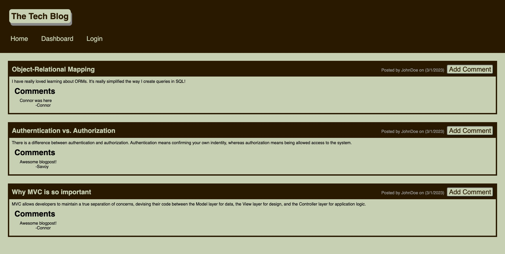

# The Tech Blog 

## Description 📃

This is a website that every coder should be on. It is a place to read and post blogs about coding and the tech world. You can even leave comments on your buddies posts! Come read some of the most imformative blog posts out there and why not give it a try and post of of your very own!

## Table of Contents

- [Where to find](#where-to-find🔌)
- [Usgae](#usage🔋)
- [Credits](#credits🙏🏻)
- [License](#license🔑)
- [Screenshot](#screenshot📸)
- [Video How To](#video📺)

## Where-to-find🔌

Heroku Link: [The Tech Blog](https://the-tech-blog-connor.herokuapp.com/)
GitHub Repo: [Connor812](https://github.com/Connor812/MVC-Tech-Blog.git)

## Usage🔋

You can use this webiste to read and post blogs about coding and the tech world. To take a tutor of the website [click here!](https://drive.google.com/file/d/1kOO0BNb8BIHLJqcYcQYl-fO6cTYcNi6J/view)

## Credits🙏🏻

Shout out to the University of Toronto for teaching me how to code!

## License🔑

[GNU GENERAL PUBLIC LICENSE Version 3, 29 June 2007](https://www.gnu.org/licenses)

## Screenshot📸

## Video📺

[How to Video](https://drive.google.com/file/d/1kOO0BNb8BIHLJqcYcQYl-fO6cTYcNi6J/view)